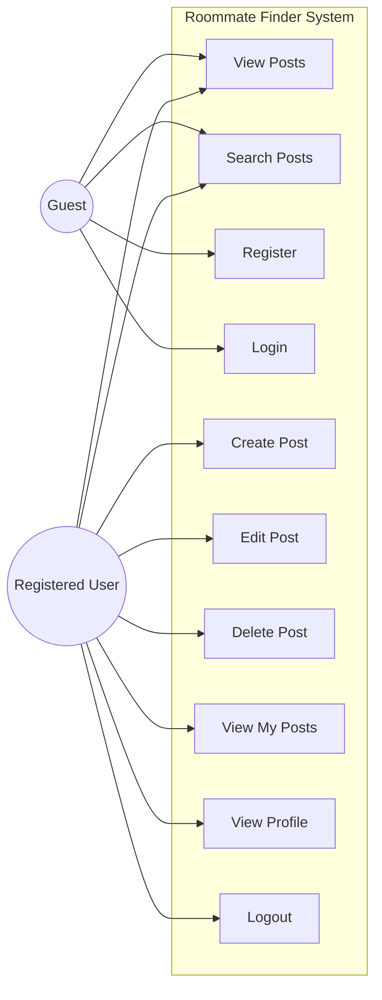

# Roommate Finder System – Use Case Diagram

```mermaid
flowchart LR
    %% Actors
    Guest((Guest))
    User((Registered User))

    %% System Boundary
    subgraph Roommate_Finder_System["Roommate Finder System"]
        UC1[View Posts]
        UC2[Search Posts]
        UC3[Register]
        UC4[Login]
        UC5[Create Post]
        UC6[Edit Post]
        UC7[Delete Post]
        UC8[View My Posts]
        UC9[View Profile]
        UC10[Logout]
    end

    %% Guest Use Cases
    Guest --> UC1
    Guest --> UC2
    Guest --> UC3
    Guest --> UC4

    %% Registered User Use Cases
    User --> UC1
    User --> UC2
    User --> UC5
    User --> UC6
    User --> UC7
    User --> UC8
    User --> UC9
    User --> UC10
```
